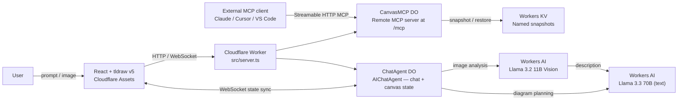

# cf_ai_canvas

An AI-powered collaborative canvas with remote MCP server on Cloudflare Workers.

---

## Live Demo

| Endpoint | URL |
|---|---|
| **App** | https://cf-ai-canvas.mc146.workers.dev |
| **MCP endpoint** | https://cf-ai-canvas.mc146.workers.dev/mcp |

---

## Assignment Mapping

| Requirement | Implementation |
|---|---|
| **LLM integration** | Workers AI — Llama 3.3 70B (text generation) + Llama 3.2 11B Vision (image analysis) |
| **Workflow / coordination** | `ChatAgent` Durable Object orchestrates intent routing, LLM calls, canvas state updates, and streaming responses |
| **User input** | Three input paths: quick-prompt buttons (auto-send), typed chat, image attachment with prompt |
| **Memory / state** | DO SQLite for chat history; DO state for live canvas; Workers KV for named snapshots |
| **Cloudflare deployment** | Workers + Durable Objects + KV + Workers AI, deployed to `workers.dev` |
| **Remote MCP server** | 17 tools via Streamable HTTP at `/mcp` — usable from Claude, Cursor, VS Code |
| **AI-assisted dev docs** | `PROMPTS.md` records prompts and implementation decisions |

---

## Architecture



---

## Three Input Paths

### 1. Quick-prompt buttons
Click any of the three preset buttons to instantly send a diagram request:
- **Draw a login flow with success and error paths** → login flow pattern (10 shapes)
- **Create a Cloudflare Workers AI architecture diagram** → CF architecture (13 shapes)
- **Draw a 4-step MCP OAuth flow** → OAuth sequence (10 shapes)

Each button auto-sends on click. No need to press Send.

### 2. Manual typed prompt
Type any diagram description in the chat box and press **Send**. Examples:
```
Draw a microservices architecture with API gateway, auth service, and database
Create a data pipeline with ingestion, validation, transformation, and warehouse
Draw a Kubernetes cluster with ingress, deployments, services, and persistent volumes
```

### 3. Image + text prompt
Click **Attach Image**, select a PNG/JPG (hand-drawn sketch, existing diagram, screenshot). The app uses Llama 3.2 Vision to extract structural context from the image, then uses that to generate a clean tldraw diagram. Works best with architecture sketches and flowcharts.

---

## Quick Start

### Local development

```bash
git clone https://github.com/Mihai-Codes/cf_ai_canvas.git
cd cf_ai_canvas
npm install

# One-time KV namespace setup
npx wrangler kv namespace create "CANVAS_KV"
# Update the KV ID in wrangler.jsonc

npx wrangler login
npm run dev
# App: http://localhost:8787
# MCP: http://localhost:8787/mcp
```

### Deploy

```bash
npm run deploy
# Deploys to https://cf-ai-canvas.mc146.workers.dev
```

### Test with MCP Inspector

```bash
npx @modelcontextprotocol/inspector@latest
# Transport: Streamable HTTP
# URL: https://cf-ai-canvas.mc146.workers.dev/mcp
```

---

## MCP Tools (17)

| Category | Tools |
|---|---|
| **CRUD** | `create_element`, `get_element`, `update_element`, `delete_element`, `batch_create_elements`, `query_elements`, `clear_canvas` |
| **Scene** | `describe_scene`, `export_scene`, `import_scene` |
| **Snapshots** | `snapshot_scene`, `restore_snapshot` |
| **Layout** | `align_elements`, `distribute_elements`, `set_viewport` |
| **Meta** | `get_canvas_stats`, `read_diagram_guide` |

---

## Cloudflare Products Used

| Product | Purpose |
|---|---|
| **Workers** | Serverless compute — hosts both agents, serves static frontend |
| **Workers AI** | Llama 3.3 70B for diagram planning; Llama 3.2 Vision for image analysis |
| **Durable Objects** | Per-session canvas state (SQLite), chat history, MCP state |
| **Workers KV** | Named canvas snapshots that persist beyond sessions |
| **Assets** | Static frontend (React + tldraw v5) |

---

## Project Structure

```
cf_ai_canvas/
├── src/
│   ├── server.ts            # Worker entry point + routing
│   ├── chat-agent.ts        # AIChatAgent — NL/image → diagram
│   ├── canvas-mcp.ts        # McpAgent — 17 canvas tools at /mcp
│   ├── client.tsx           # React + tldraw v5 frontend
│   ├── diagram-patterns.ts  # Deterministic pattern library for 5 diagram types
│   ├── types.ts             # Shared TypeScript types
│   └── styles.css           # App styles + tldraw arrow label overrides
├── test/
│   └── diagram-scenarios.spec.ts  # Playwright e2e — all 3 input paths
├── test-results/            # Playwright screenshots
├── .github/workflows/ci.yml # CI: typecheck + build + deploy
├── PROMPTS.md               # AI-assisted development log
└── wrangler.jsonc           # Cloudflare bindings configuration
```

---

## Test Results (Playwright, live app)

All 7 tests pass against https://cf-ai-canvas.mc146.workers.dev in ~50s:

| Test | Input path | Elements |
|---|---|---|
| Login flow | Quick prompt | 10 |
| Cloudflare architecture | Quick prompt | 13 |
| MCP OAuth flow | Quick prompt | 10 |
| Microservices | Manual prompt | 10 |
| Data pipeline | Manual prompt | 11 |
| Architecture image | Image + prompt (Vision) | 13 |
| MCP endpoint | API check | pass |

```bash
npm test
```

---

## CI/CD

GitHub Actions runs on every push to `main`:
1. Typecheck (`tsc --noEmit`)
2. Build (`vite build`)
3. Deploy (`npx wrangler deploy` — now blocking to ensure successful deployment, requires `Zone:Read` on the API token)

Required secrets: `CLOUDFLARE_ACCOUNT_ID`, `CLOUDFLARE_API_TOKEN`

## Troubleshooting & Cache

If the canvas appears empty or disappears after a page refresh:

- Perform a hard refresh (Ctrl + Shift + R / Cmd + Shift + R).
- Open DevTools → Application → Service Workers and click “Unregister” for any registered workers.
- The app now automatically unregisters Service Workers and clears the `caches` storage on load, reducing stale asset issues.
- Verify the JavaScript bundle version matches the latest deploy (check the network tab for a URL containing the current `Version ID` printed in the console).
- If errors appear in the console (e.g., “Canvas crashed”, “[canvas] Skipped shape”), report them for further debugging.

---

## References

- [Cloudflare Agents SDK](https://developers.cloudflare.com/agents/)
- [McpAgent API](https://developers.cloudflare.com/agents/api-reference/mcp-agent-api/)
- [tldraw v5 SDK](https://tldraw.dev/)
- [Workers AI models](https://developers.cloudflare.com/workers-ai/models/)
