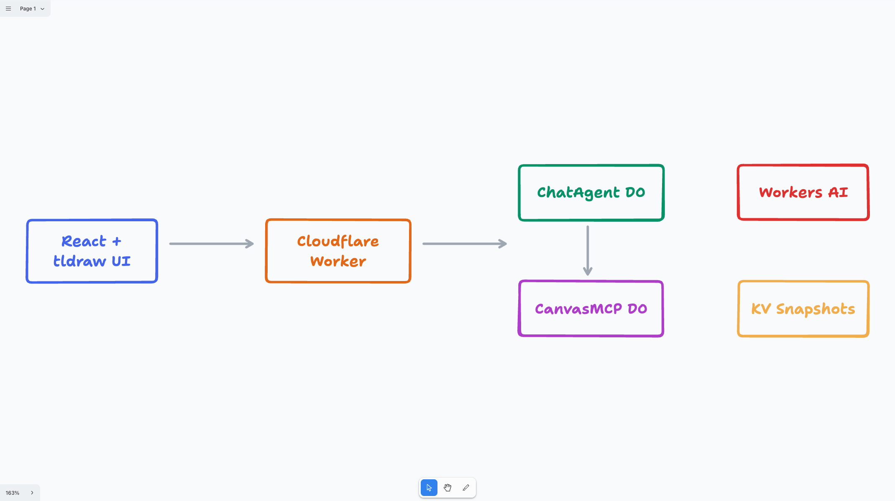
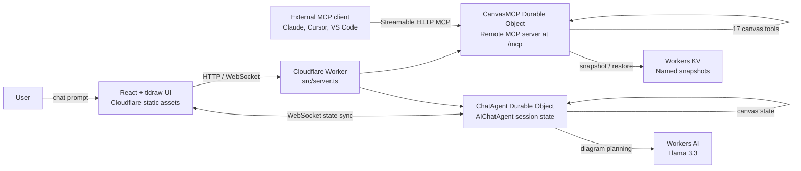
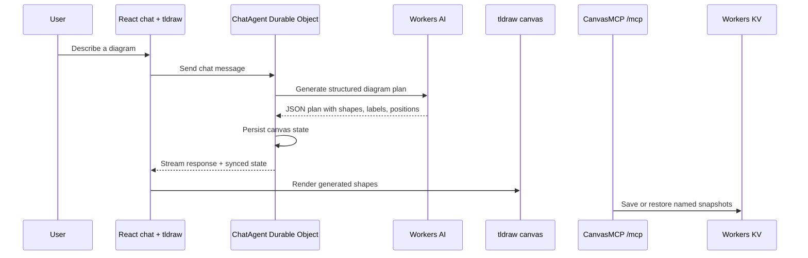

# cf_ai_canvas

**AI-Powered Collaborative Canvas as a Remote MCP Server on Cloudflare Workers**

> Built for the Cloudflare Software Engineering Internship (Summer 2026) assignment.

[](https://cf-ai-canvas.mc146.workers.dev)
[](https://cf-ai-canvas.mc146.workers.dev/mcp)
[](https://developers.cloudflare.com/workers/)
[](https://developers.cloudflare.com/workers-ai/)
[](https://developers.cloudflare.com/durable-objects/)
[](https://tldraw.dev/)

## Live Demo

- App: https://cf-ai-canvas.mc146.workers.dev
- MCP endpoint: https://cf-ai-canvas.mc146.workers.dev/mcp

## tldraw-Generated Architecture

Generated in the live app with the prompt `Create a Cloudflare Workers AI architecture diagram`.



## Assignment Mapping

| Requirement | Implementation |
|-------------|----------------|
| **LLM** | Workers AI using Llama 3.3 for natural language to diagram planning |
| **Workflow / coordination** | Cloudflare Workers route requests; Durable Objects coordinate per-session chat, canvas, and MCP state |
| **User input** | React chat interface served by Cloudflare Workers static assets |
| **Memory or state** | Durable Object state for live canvas/session data; KV for named canvas snapshots |
| **Cloudflare deployment** | Deployed Worker at `cf-ai-canvas.mc146.workers.dev` |
| **AI-assisted development docs** | `PROMPTS.md` records the prompts and implementation decisions |

## 🎯 What It Does

Describe what you want to draw in natural language — flowcharts, architecture diagrams, system designs — and an AI agent creates it on a live canvas in real-time.

**Plus:** Any MCP client (Claude, Cursor, Copilot, VS Code) can connect to the remote `/mcp` endpoint and programmatically control the canvas with 17 tools.

## 🏗️ Architecture



## Request Flow



The live app includes a quick prompt, `Create a Cloudflare Workers AI architecture diagram`, which uses the same tldraw canvas path to generate an architecture diagram interactively.

## Canvas Rendering Note

The project stores and syncs tldraw-compatible canvas elements. In local development, the full tldraw editor renders without a license. On production HTTPS domains, tldraw SDK v4+ requires a license key, so the deployed app includes a read-only SVG renderer for generated diagrams when `VITE_TLDRAW_LICENSE_KEY` is not configured.

To enable the production tldraw editor, request a tldraw trial or hobby license and build with:

```bash
VITE_TLDRAW_LICENSE_KEY="your-license-key" npm run build
npm run deploy
```

For CI/CD, add `VITE_TLDRAW_LICENSE_KEY` as a GitHub Actions secret. The workflow passes it into the Vite build step without committing the key.

## ☁️ Cloudflare Products Used

| Product | Purpose |
|---------|---------|
| **Workers** | Serverless compute — hosts both agents and serves frontend |
| **Workers AI** | Llama 3.3 70B for natural language → diagram generation |
| **Durable Objects** | Per-session canvas state with SQLite persistence |
| **KV** | Named canvas snapshots that persist beyond sessions |
| **Pages/Assets** | Static frontend (React + tldraw) |

## 🛠️ MCP Tools (17)

| Category | Tools |
|----------|-------|
| **CRUD** | `create_element`, `get_element`, `update_element`, `delete_element`, `batch_create_elements`, `query_elements`, `clear_canvas` |
| **Scene** | `describe_scene`, `export_scene`, `import_scene` |
| **State** | `snapshot_scene`, `restore_snapshot` |
| **Layout** | `align_elements`, `distribute_elements`, `set_viewport` |
| **Docs/Meta** | `get_canvas_stats`, `read_diagram_guide` |

## 🚀 Quick Start

### Prerequisites
- Node.js 18+
- Cloudflare account ([free tier works](https://dash.cloudflare.com/sign-up))

### Local Development

```bash
# Clone
git clone https://github.com/Mihai-Codes/cf_ai_canvas.git
cd cf_ai_canvas

# Install
npm install

# Create KV namespace (one-time)
npx wrangler kv namespace create "CANVAS_KV"
# Update the KV ID in wrangler.jsonc

# Log in before running the full Worker locally
npx wrangler login

# Run locally
npm run dev
# Server at http://localhost:8787
# MCP endpoint at http://localhost:8787/mcp
```

### Test with MCP Inspector

```bash
npx @modelcontextprotocol/inspector@latest
# Enter URL: http://localhost:8787/mcp
# Click Connect → List Tools
```

### Deploy to Cloudflare

```bash
npm run deploy
# Live at https://cf-ai-canvas.mc146.workers.dev
# MCP at https://cf-ai-canvas.mc146.workers.dev/mcp
```

### Connect from Claude Desktop

```json
{
  "mcpServers": {
        "canvas": {
          "command": "npx",
          "args": [
            "mcp-remote",
            "https://cf-ai-canvas.mc146.workers.dev/mcp"
          ]
        }
      }
}
```

## 💬 Chat Interface

Open the deployed URL in a browser. The React client connects to `ChatAgent` with `useAgentChat`, and the tldraw canvas renders synchronized agent state.

## 🧪 Testing

```bash
npm run lint
npm run build
```

## 🔁 CI/CD

GitHub Actions runs on every pull request and every push to `main`:

- `npm ci`
- `npm run lint`
- `npm run build`
- guarded Cloudflare deploy on `main`

To enable automatic deployments from GitHub, add these repository secrets:

| Secret | Value |
|--------|-------|
| `CLOUDFLARE_ACCOUNT_ID` | Cloudflare account ID for the Workers account |
| `CLOUDFLARE_API_TOKEN` | API token scoped to edit/deploy Workers on that account |

The workflow is defined in `.github/workflows/ci.yml`. If the secrets are missing, the deploy step is skipped while checks still run.

## 📁 Project Structure

```
cf_ai_canvas/
├── src/
│   ├── server.ts          # Worker entry point
│   ├── canvas-mcp.ts      # McpAgent — 17 canvas tools + state
│   ├── chat-agent.ts      # AIChatAgent — NL→canvas via Llama 3.3
│   ├── client.tsx         # React chat + tldraw frontend
│   ├── styles.css         # Frontend styling
│   └── types.ts           # Shared TypeScript types
├── index.html             # Vite frontend entry
├── public/
│   └── index.html         # Static fallback redirect
├── wrangler.jsonc          # Cloudflare configuration
├── PROMPTS.md              # AI prompts used (assignment requirement)
└── README.md
```

## 🔒 Security

- MCP endpoint is currently public (no auth required for demo)
- GitHub OAuth can be added following the [Cloudflare MCP auth guide](https://developers.cloudflare.com/agents/guides/remote-mcp-server/#add-authentication)
- Input validation via Zod on all tool parameters

## 📚 References

- [Cloudflare Agents SDK](https://developers.cloudflare.com/agents/)
- [McpAgent API](https://developers.cloudflare.com/agents/api-reference/mcp-agent-api/)
- [Remote MCP Server Guide](https://developers.cloudflare.com/agents/guides/remote-mcp-server/)
- [tldraw](https://tldraw.dev/) — infinite canvas SDK
- [Original tldraw-mcp-server](https://github.com/Mihai-Codes/tldraw-mcp-server) — local MCP server this project is based on

## 👤 Author

**Mihai-Alexandru Chindriș** — [GitHub](https://github.com/chindris-mihai-alexandru) | [LinkedIn](https://www.linkedin.com/in/mihai-chindris/)

Built for the Cloudflare Software Engineering Internship (Summer 2026) application.
