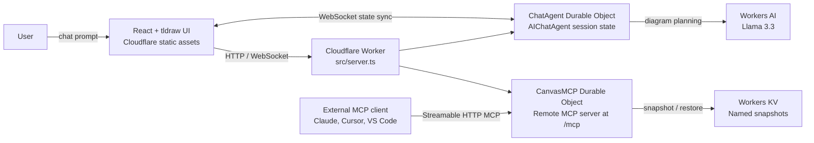

# cf_ai_canvas

**AI-powered collaborative canvas + remote MCP server on Cloudflare Workers**

> Built for the Cloudflare Software Engineering Internship (Summer 2026) assignment.

[](https://cf-ai-canvas.mc146.workers.dev)
[](https://cf-ai-canvas.mc146.workers.dev/mcp)
[](https://developers.cloudflare.com/workers/)
[](https://developers.cloudflare.com/workers-ai/)
[](https://developers.cloudflare.com/durable-objects/)
[](https://tldraw.dev/)

## Live Demo

- App: https://cf-ai-canvas.mc146.workers.dev
- MCP endpoint: https://cf-ai-canvas.mc146.workers.dev/mcp

## Assignment Requirement → Implementation Mapping

| Assignment requirement | Concrete implementation in this repo | File(s) | Runtime proof |
|---|---|---|---|
| **Use an LLM** | `ChatAgent` uses Workers AI model `@cf/meta/llama-3.3-70b-instruct-fp8-fast` to turn prompts into diagram plans | `src/chat-agent.ts` | Open app, send prompt, see generated diagram + chat response |
| **Workflow / coordination layer** | Worker routes both chat + MCP traffic and coordinates stateful agents | `src/server.ts` | `/` serves UI, `/mcp` serves remote MCP transport |
| **User input (chat UI)** | React split-view app with quick prompts and freeform input | `src/client.tsx`, `src/styles.css` | Live app left panel accepts prompts |
| **Memory/state** | Durable Object session state stores live canvas; KV stores named snapshots | `src/chat-agent.ts`, `src/canvas-mcp.ts`, `wrangler.jsonc` | Canvas persists within session; MCP snapshot/restore tools use KV |
| **Remote MCP server** | `CanvasMCP` exposes 17 tools via Streamable HTTP transport | `src/canvas-mcp.ts`, `src/server.ts` | `https://cf-ai-canvas.mc146.workers.dev/mcp` + MCP Inspector `tools/list` |
| **AI-assisted development documentation** | Prompt log and decisions captured for reviewer traceability | `PROMPTS.md` | Documented prompt history in repo |

## What to test in 2 minutes

1. Open the live app.
2. Click quick prompt **Create a Cloudflare Workers AI architecture diagram**.
3. Confirm the right-side canvas renders a rich multi-node architecture diagram.
4. Confirm chat output is clean (no Chromium `--no-sandbox` warning text).
5. Click quick prompt **Draw a 4-step MCP OAuth flow** and confirm non-generic flow output.
6. (Optional) Connect MCP Inspector to `/mcp`, run `tools/list`, confirm all 17 tools.

## Screenshots (refreshed)

| File | Prompt / action used | Demonstrates | Captured |
|---|---|---|---|
| `docs/assets/tldraw-architecture.png` | `Create a Cloudflare Workers AI architecture diagram` | Rich architecture quick prompt output on canvas | May 6, 2026 |
| `docs/assets/chat-canvas-clean-ui-2026-05-06.png` | Quick prompt run in split view | Chat + canvas UI with clean assistant text (no `--no-sandbox`) | May 6, 2026 |

### Screenshot refresh SOP

1. Run the app (`npm run dev`) and open `http://localhost:8787`.
2. Trigger each quick prompt once to ensure deterministic rich diagrams appear.
3. Capture full split-view screenshots (chat + canvas visible).
4. Save PNG files under `docs/assets/` using date-stamped names.
5. Update this table with prompt text + capture date.

## Architecture



## Canvas Rendering Note

The project stores and syncs tldraw-compatible elements. In production HTTPS environments, tldraw SDK v4+ requires a license key. If `VITE_TLDRAW_LICENSE_KEY` is absent, the app falls back to a read-only SVG renderer so generated diagrams remain visible.

Enable production tldraw editor with:

```bash
VITE_TLDRAW_LICENSE_KEY="your-license-key" npm run build
npm run deploy
```

## Cloudflare Products Used

| Product | Purpose |
|---|---|
| Workers | Serverless compute for app + MCP routing |
| Workers AI | Llama 3.3 model inference |
| Durable Objects | Session-scoped state and synchronization |
| Workers KV | Named snapshot persistence |
| Assets | Frontend hosting |

## MCP Tools (17)

| Category | Tools |
|---|---|
| CRUD | `create_element`, `get_element`, `update_element`, `delete_element`, `batch_create_elements`, `query_elements`, `clear_canvas` |
| Scene | `describe_scene`, `export_scene`, `import_scene` |
| State | `snapshot_scene`, `restore_snapshot` |
| Layout | `align_elements`, `distribute_elements`, `set_viewport` |
| Docs/Meta | `get_canvas_stats`, `read_diagram_guide` |

## Quick Start

### Prerequisites
- Node.js 18+
- Cloudflare account ([free tier works](https://dash.cloudflare.com/sign-up))

### Local development

```bash
git clone https://github.com/Mihai-Codes/cf_ai_canvas.git
cd cf_ai_canvas
npm install

npx wrangler kv namespace create "CANVAS_KV"
# Then update the KV id in wrangler.jsonc

npx wrangler login
npm run dev
# App: http://localhost:8787
# MCP: http://localhost:8787/mcp
```

### MCP Inspector

```bash
npx @modelcontextprotocol/inspector@latest
# Connect to: http://localhost:8787/mcp
```

### Deploy

```bash
npm run deploy
# App: https://cf-ai-canvas.mc146.workers.dev
# MCP: https://cf-ai-canvas.mc146.workers.dev/mcp
```

## CI/CD and required GitHub secrets

GitHub Actions workflow: `.github/workflows/ci.yml`

- Runs on every PR and push to `main`
- Executes `npm ci`, typecheck (`npm run lint`), and production `npm run build`
- Deploy job runs only on `main` pushes and only when Cloudflare secrets are present

### Required secrets

| Secret | Required value |
|---|---|
| `CLOUDFLARE_API_TOKEN` | Cloudflare API token with Workers deploy permissions |
| `CLOUDFLARE_ACCOUNT_ID` | `9f26393d5ba4186296b36e2af8714b1c` |
| `VITE_TLDRAW_LICENSE_KEY` | Optional, only needed for licensed production tldraw editor |

### GitHub UI setup

1. Repository → **Settings** → **Secrets and variables** → **Actions**.
2. Add the three secrets above exactly as named.
3. Re-run latest `main` workflow.

### Optional `gh` CLI setup

```bash
gh secret set CLOUDFLARE_ACCOUNT_ID --body "9f26393d5ba4186296b36e2af8714b1c"
gh secret set CLOUDFLARE_API_TOKEN --body "<your-token>"
gh secret set VITE_TLDRAW_LICENSE_KEY --body "<optional-license-key>"
```

### Verification checklist

- Verify job passes `Typecheck and build`.
- On `main`, verify deploy step is **not skipped**.
- Confirm live URL serves latest commit.

## Project Structure

```text
cf_ai_canvas/
├── src/
│   ├── server.ts          # Worker entry point
│   ├── canvas-mcp.ts      # McpAgent — 17 canvas tools + state
│   ├── chat-agent.ts      # AIChatAgent — NL → canvas planner + templates
│   ├── client.tsx         # React chat + canvas UI
│   ├── styles.css         # Frontend styling
│   └── types.ts           # Shared TypeScript types
├── docs/assets/           # README screenshots
├── wrangler.jsonc         # Cloudflare bindings/config
├── PROMPTS.md             # Assignment-required AI prompt log
└── README.md
```

## References

- [Cloudflare Agents SDK](https://developers.cloudflare.com/agents/)
- [McpAgent API](https://developers.cloudflare.com/agents/api-reference/mcp-agent-api/)
- [Remote MCP Server Guide](https://developers.cloudflare.com/agents/guides/remote-mcp-server/)
- [tldraw](https://tldraw.dev/)
- [Original tldraw-mcp-server](https://github.com/Mihai-Codes/tldraw-mcp-server)

## Author

**Mihai-Alexandru Chindriș** — [GitHub](https://github.com/chindris-mihai-alexandru) | [LinkedIn](https://www.linkedin.com/in/mihai-chindris/)
