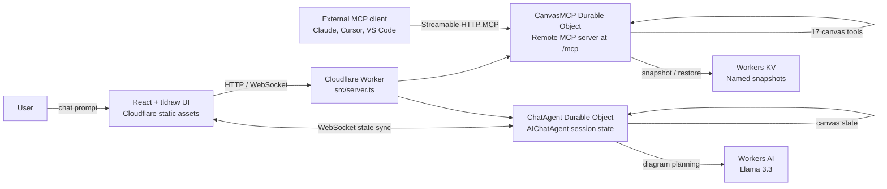

# cf_ai_canvas

**AI-powered collaborative canvas + remote MCP server on Cloudflare Workers**

Built for the Cloudflare Software Engineering Internship (Summer 2026) assignment.

## Live Demo

- **App**: https://cf-ai-canvas.mc146.workers.dev
- **MCP Endpoint**: https://cf-ai-canvas.mc146.workers.dev/mcp

## Assignment Mapping

| Requirement | Implementation |
|-------------|----------------|
| **LLM** | Workers AI using Llama 3.3 for natural language to diagram planning |
| **Workflow / coordination** | Cloudflare Workers route requests; Durable Objects coordinate per-session chat, canvas, and MCP state |
| **User input** | React chat interface served by Cloudflare Workers static assets |
| **Memory or state** | Durable Object state for live canvas/session data; KV for named canvas snapshots |
| **Cloudflare deployment** | Deployed Worker at `cf-ai-canvas.mc146.workers.dev` |
| **AI-assisted development docs** | `PROMPTS.md` records the prompts and implementation decisions |

## Architecture



## Quick Start

### Local Development

```bash
# Clone
git clone https://github.com/Mihai-Codes/cf_ai_canvas.git
cd cf_ai_canvas

# Install
npm install

# Create KV namespace (one-time)
npx wrangler kv namespace create "CANVAS_KV"
# Update the KV ID in wrangler.jsonc

# Log in before running the full Worker locally
npx wrangler login

# Run locally
npm run dev
# Server at http://localhost:8787
# MCP endpoint at http://localhost:8787/mcp
```

### Test with MCP Inspector

```bash
npx @modelcontextprotocol/inspector@latest
# Enter URL: http://localhost:8787/mcp
# Click Connect → List Tools
```

### Deploy to Cloudflare

```bash
npm run deploy
# Live at https://cf-ai-canvas.mc146.workers.dev
# MCP at https://cf-ai-canvas.mc146.workers.dev/mcp
```

## MCP Tools (17)

| Category | Tools |
|----------|-------|
| **CRUD** | `create_element`, `get_element`, `update_element`, `delete_element`, `batch_create_elements`, `query_elements`, `clear_canvas` |
| **Scene** | `describe_scene`, `export_scene`, `import_scene` |
| **State** | `snapshot_scene`, `restore_snapshot` |
| **Layout** | `align_elements`, `distribute_elements`, `set_viewport` |
| **Docs/Meta** | `get_canvas_stats`, `read_diagram_guide` |

## Cloudflare Products Used

| Product | Purpose |
|---------|---------|
| **Workers** | Serverless compute — hosts both agents and serves frontend |
| **Workers AI** | Llama 3.3 70B for natural language → diagram generation |
| **Durable Objects** | Per-session canvas state with SQLite persistence |
| **KV** | Named canvas snapshots that persist beyond sessions |
| **Pages/Assets** | Static frontend (React + tldraw) |

## Project Structure

```
cf_ai_canvas/
├── src/
│   ├── server.ts          # Worker entry point
│   ├── canvas-mcp.ts      # McpAgent — 17 canvas tools
│   ├── chat-agent.ts      # AIChatAgent — NL→canvas
│   ├── client.tsx         # React + tldraw frontend
│   └── types.ts           # Shared TypeScript types
├── docs/assets/           # Screenshots
├── .github/workflows/    # CI/CD pipeline
├── PROMPTS.md             # AI prompts used
├── README.md              # Documentation
└── wrangler.jsonc         # Cloudflare configuration
```

## Testing

Run MCP endpoint tests:

```bash
npm test
```

Tests verify:
- Basic endpoint reachability
- Accept header requirement
- Session ID requirement
- JSON-RPC error format compliance

## CI/CD

GitHub Actions runs on every pull request and push to `main`:
- Typecheck
- Production build
- Guarded Cloudflare deploy on `main`

Required secrets:
- `CLOUDFLARE_ACCOUNT_ID`
- `CLOUDFLARE_API_TOKEN` (Account:Read + Workers Scripts:Edit)
- `VITE_TLDRAW_LICENSE_KEY` (optional for production editor)

## References

- [Cloudflare Agents SDK](https://developers.cloudflare.com/agents/)
- [McpAgent API](https://developers.cloudflare.com/agents/api-reference/mcp-agent-api/)
- [Remote MCP Server Guide](https://developers.cloudflare.com/agents/guides/remote-mcp-server/)
- [tldraw](https://tldraw.dev/)
- [Original tldraw-mcp-server](https://github.com/Mihai-Codes/tldraw-mcp-server)